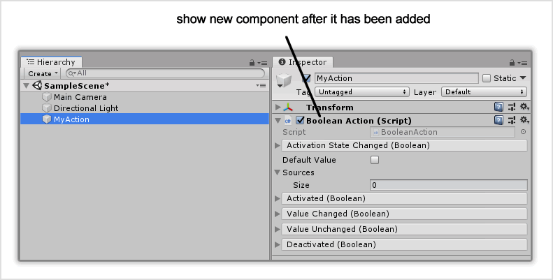
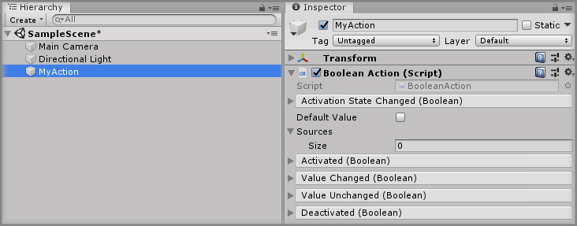

# Adding A Component To A GameObject

## Text Example

```
Select the `<GameObject>` GameObject from the Unity Hierarchy and click the `Add Component` button, then select the `<Component>` component.

This newly created `<Component>` will be _insert reason for adding component_.
```

---

> Markdown output example

Select the `<GameObject>` GameObject from the Unity Hierarchy and click the `Add Component` button, then select the `<Component>` component.

This newly created `<Component>` will be _insert reason for adding component_.

## Image Example

```

```


## Final Output

```
### Step X

Select the `MyAction` GameObject from the Unity Hierarchy and click the `Add Component` button, then select the `Boolean Action` component.

This newly created `Boolean Action` will be the action that defines the toggle state of our GameObject.


```

---

> Markdown output

### Step X

Select the `MyAction` GameObject from the Unity Hierarchy and click the `Add Component` button, then select the `Boolean Action` component.

This newly created `Boolean Action` will be the action that defines the toggle state of our GameObject.


## Resources

* Example Graphic
  * [Fireworks PNG](assets/resource/FireworksPNG.fw.png)
  * [Photoshop PSD](assets/resource/PhotoshopPSD.psd)