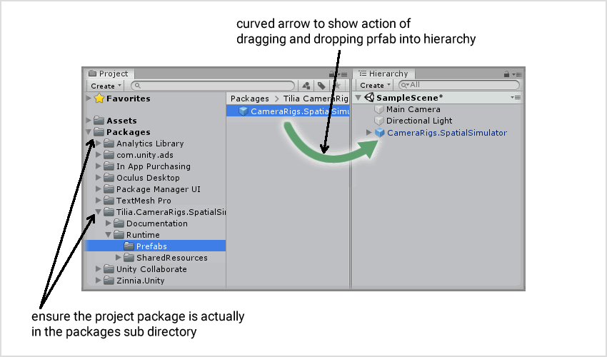
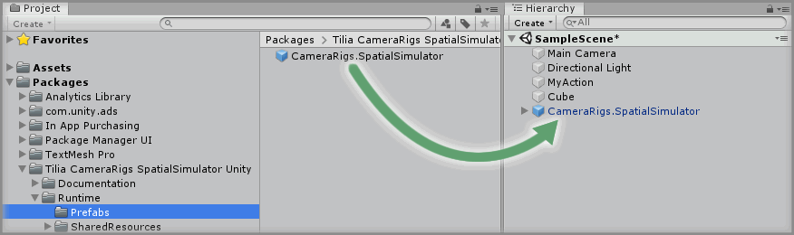

# Adding A Package To A Scene

## Text Example

```
Expand the `<Package Name Goes Here>` package directory in the Unity Project window and select the `Packages -> <Package Name> -> Runtime -> Prefabs` directory then drag and drop the `<NameOf.Prefab>` prefab into the Unity Hierarchy window.
```

---

> Markdown output example

Expand the `Package Name Goes Here` package directory in the Unity Project window and select the `Packages -> Package Name -> Runtime -> Prefabs` directory then drag and drop the `NameOf.Prefab` prefab into the Unity Hierarchy window.

## Image Example

```

```


## Final Output

```
### Step X

Expand the `Tilia CameraRigs SpatialSimulator Unity` package directory in the Unity Project window and select the `Packages -> Tilia CameraRigs SpatialSimulator Unity -> Runtime -> Prefabs` directory then drag and drop the `CameraRigs.SpatialSimulator` prefab into the Unity Hierarchy window.


```

---

> Markdown output

### Step X

Expand the `Tilia CameraRigs SpatialSimulator Unity` package directory in the Unity Project window and select the `Packages -> Tilia CameraRigs SpatialSimulator Unity -> Runtime -> Prefabs` directory then drag and drop the `CameraRigs.SpatialSimulator` prefab into the Unity Hierarchy window.


## Resources

* Example Graphic
  * [Fireworks PNG](assets/resource/FireworksPNG.fw.png)
  * [Photoshop PSD](assets/resource/PhotoshopPSD.psd)