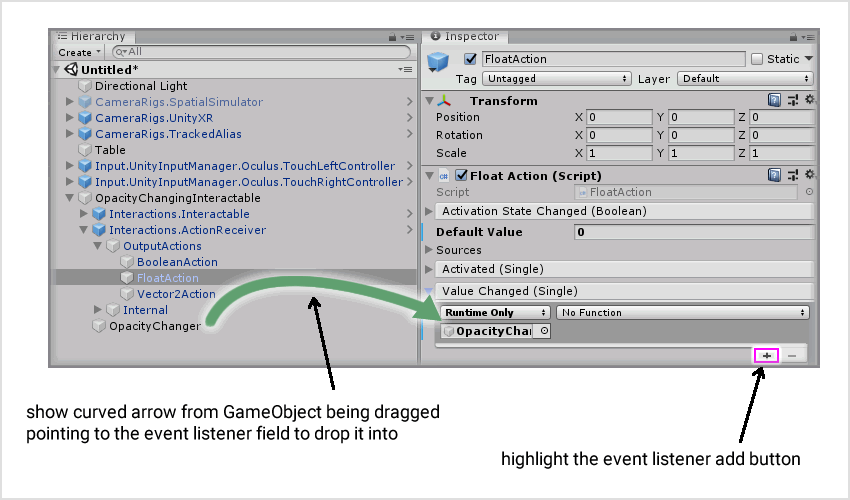
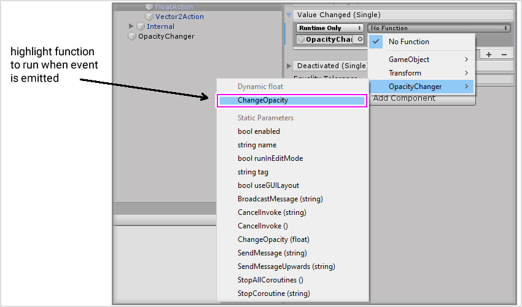
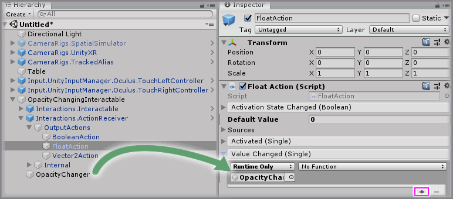
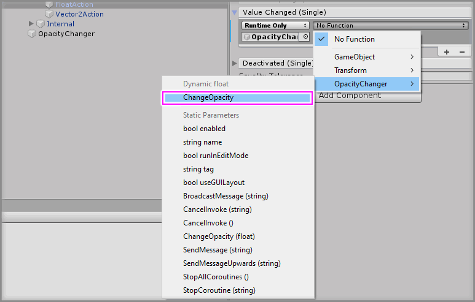

# Adding A Unity Event Listener

## Text Example

```
Select the `<GameObject>` GameObject from the Unity Hierarchy and click the `+` symbol in the bottom right corner of the `<Event Name>` event parameter on the `<Component>` component.

Drag and drop the `<GameObject>` GameObject into the event listener box that appears on the `<Event Name>` event parameter on the `<Component>` component that displays `None (Object)`.

<First Image>

Select a function to perform when the `<Event Name>` event is emitted. For this example, select the `<Component> -> <Function>` function (be sure to select `Dynamic <type> - <Function>` for this example) [or] (be sure to select `Static Parameters - <Function(value)>` for this example).

<Second Image>
```

---

> Markdown output example

Select the `<GameObject>` GameObject from the Unity Hierarchy and click the `+` symbol in the bottom right corner of the `<Event Name>` event parameter on the `<Component>` component.

Drag and drop the `<GameObject>` GameObject into the event listener box that appears on the `<Event Name>` event parameter on the `<Component>` component that displays `None (Object)`.

<First Image>

Select a function to perform when the `<Event Name>` event is emitted. For this example, select the `<Component> -> <Function>` function (be sure to select `Dynamic <type> - <Function>` for this example) [or] (be sure to select `Static Parameters - <Function(value)>` for this example).

<Second Image>

## Image Example

### First Image

```

```


### Second Image

```

```


## Final Output

```
### Step X

Select the `OpacityChangingInteractable -> Interactions.ActionReceiver -> OutputActions -> FloatAction` GameObject from the Unity Hierarchy and click the `+` symbol in the bottom right corner of the `Value Changed` event parameter on the `Float Action` component.

Drag and drop the `OpacityChangingInteractable -> OpacityChanger` GameObject into the event listener box that appears on the `Value Changed` event parameter on the `Float Action` component that displays `None (Object)`.



Select a function to perform when the `Value Changed` event is emitted. For this example, select the `OpacityChanger -> ChangeOpacity` function (be sure to select `Dynamic float - ChangeOpacity` for this example).


```

---

> Markdown output

### Step X

Select the `OpacityChangingInteractable -> Interactions.ActionReceiver -> OutputActions -> FloatAction` GameObject from the Unity Hierarchy and click the `+` symbol in the bottom right corner of the `Value Changed` event parameter on the `Float Action` component.

Drag and drop the `OpacityChangingInteractable -> OpacityChanger` GameObject into the event listener box that appears on the `Value Changed` event parameter on the `Float Action` component that displays `None (Object)`.


Select a function to perform when the `Value Changed` event is emitted. For this example, select the `OpacityChanger -> ChangeOpacity` function (be sure to select `Dynamic float - ChangeOpacity` for this example).

