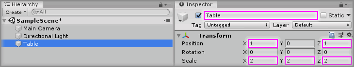

# Creating A Unity Primitive

## Text Example

```
Create a new `<Primitive Type>` Unity 3D Object by selecting `Main Menu -> GameObject -> 3D Object -> <Primitive Type>` and change the Transform properties to:

<Only list Transform Properties that will change.>

* Position: `X = 0, Y = 0, Z = 0`
* Rotation: `X = 0, Y = 0, Z = 0`
* Scale: `X = 1, Y = 1, Z = 1`

Rename the new `<Primitive Type>` to `<Name Required>`.
```

---

> Markdown output example

Create a new `Cube` Unity 3D Object by selecting `Main Menu -> GameObject -> 3D Object -> Cube` and change the Transform properties to:

* Position: `X = 1, Y = 0, Z = 1`
* Scale: `X = 2, Y = 2, Z = 2`

Rename the new `Cube` to `Table`.

## Image Example

```

```


## Final Output

```
### Step X

Create a new `Cube` Unity 3D Object by selecting `Main Menu -> GameObject -> 3D Object -> Cube` and change the Transform properties to:

* Position: `X = 1, Y = 0, Z = 1`
* Scale: `X = 2, Y = 2, Z = 2`

Rename the new `Cube` to `Table`.


```

---

> Markdown output

Create a new `Cube` Unity 3D Object by selecting `Main Menu -> GameObject -> 3D Object -> Cube` and change the Transform properties to:

* Position: `X = 1, Y = 0, Z = 1`
* Scale: `X = 2, Y = 2, Z = 2`

Rename the new `Cube` to `Table`.


## Resources

* Example Graphic
  * [Fireworks PNG](assets/resource/FireworksPNG.fw.png)
  * [Photoshop PSD](assets/resource/PhotoshopPSD.psd)