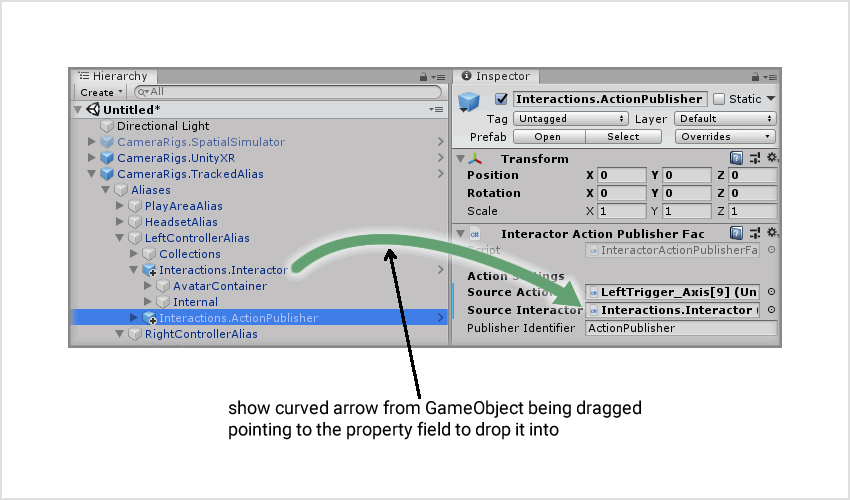
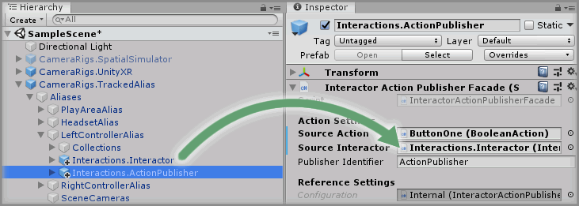

# Dragging A GameObject To A Component Property

## Text Example

```
Drag and drop the `<GameObject>` GameObject into the `<Paramter Field>` property on the `<Component>` component.
```

---

> Markdown output example

Drag and drop the `<GameObject>` GameObject into the `<Paramter Field>` property on the `<Component>` component.

## Image Example

```

```


## Final Output

```
### Step X

Drag and drop the `Interactions.Interactor` GameObject into the `Source Interactor` property on the `Interactor Action Publisher Facade` component.


```

---

> Markdown output

### Step X

Drag and drop the `Interactions.Interactor` GameObject into the `Source Interactor` property on the `Interactor Action Publisher Facade` component.


## Resources

* Example Graphic
  * [Fireworks PNG](assets/resource/FireworksPNG.fw.png)
  * [Photoshop PSD](assets/resource/PhotoshopPSD.psd)