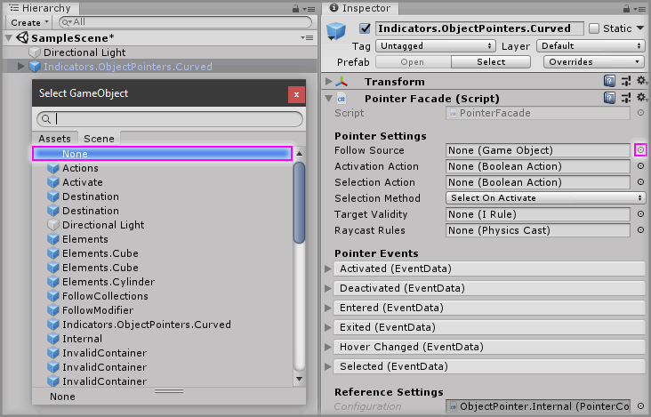

# Resetting Component Property Back To None

## Text Example

```
Select the `<GameObject>` GameObject from the Unity Hierarchy and set the `<Property>` property on the `<Component>` component back to `None` by clicking the object picker icon next to the property field and in the `Select <Type>` popup window then choose `None` from the list.
```

---

> Markdown output example

Select the `<GameObject>` GameObject from the Unity Hierarchy and set the `<Property>` property on the `<Component>` component back to `None` by clicking the object picker icon next to the property field and in the `Select <Type>` popup window then choose `None` from the list.

## Image Example

```

```


## Final Output

```
### Step X

Select the `Indicators.ObjectPointers.Curved` GameObject from the Unity Hierarchy and set the `Follow Source` property on the `Pointer Facade` component back to `None` by clicking the object picker icon next to the property field and in the `Select GameObject` popup window then choose `None` from the list.


```

---

> Markdown output

### Step X

Select the `Indicators.ObjectPointers.Curved` GameObject from the Unity Hierarchy and set the `Follow Source` property on the `Pointer Facade` component back to `None` by clicking the object picker icon next to the property field and in the `Select GameObject` popup window then choose `None` from the list.


## Resources

* Example Graphic
  * [Fireworks PNG](assets/resource/FireworksPNG.fw.png)
  * [Photoshop PSD](assets/resource/PhotoshopPSD.psd)