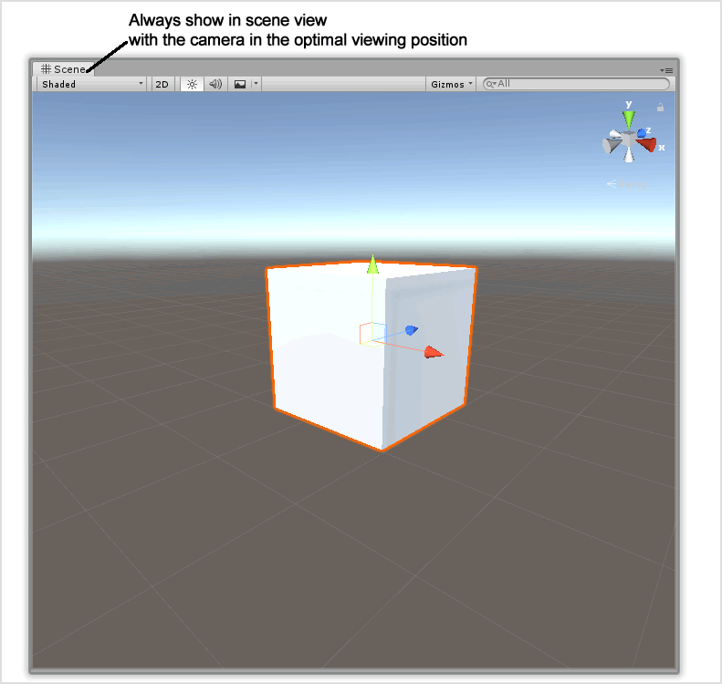
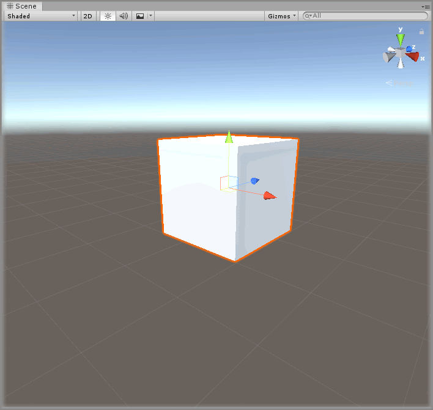

# Showing The Scene

## Text Example

```
Play the Unity scene _insert what is expected to be seen_.
```

---

> Markdown output example

Play the Unity scene _insert what is expected to be seen_.

## Image Example

```

```


## Final Output

```
### Step X

Play the Unity scene and see how the cube is displayed and can be moved around with the arrow keys.


```

---

> Markdown output

### Step X

Play the Unity scene and see how the cube is displayed and can be moved around with the arrow keys.


## Resources

* Example Graphic
  * [Fireworks PNG](assets/resource/FireworksPNG.fw.png)
  * [Photoshop PSD](assets/resource/PhotoshopPSD.psd)