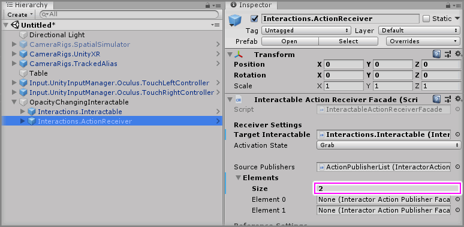
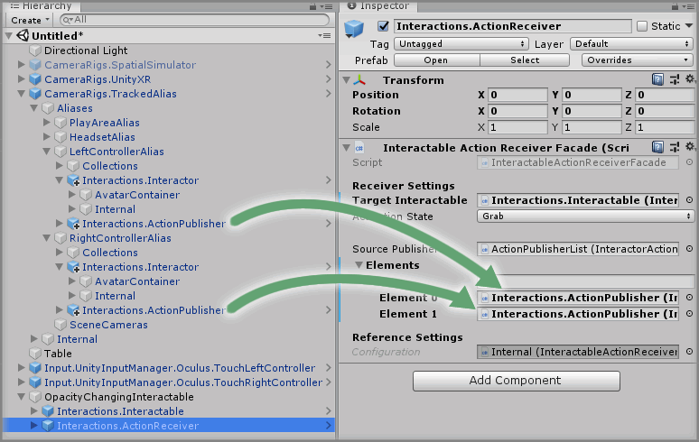

# Updating A Component List Property

## Text Example

```
### Step X1

Select the `<GameObject>` GameObject from the Unity Hierarchy then increase the `<Property Name> -> Elements -> Size` property value by `<number to increase by>` on the `<Component>` component.

> The size property will be `0` by default, so change it to `<number to change to>`.

### Step X2

Drag and drop the `<GameObject>` GameObject into the newly created `Element 0` property value within `<Paramter Field>` property on the `<Component>` component.

> Do this for all other List items.
```

---

> Markdown output example

### Step X1

Select the `<GameObject>` GameObject from the Unity Hierarchy then increase the `<Property Name> -> Elements -> Size` property value by `<number to increase by>` on the `<Component>` component.

> The size property will be `0` by default, so change it to `<number to change to>`.

### Step X2

Drag and drop the `<GameObject>` GameObject into the newly created `Element 0` property value within `<Paramter Field>` property on the `<Component>` component.

> Do this for all other List items.

## Final Output

```
### Step X1

Select the `OpacityChangingInteractable -> Interactions.ActionReceiver` GameObject from the Unity Hierarchy then increase the `Source Publishers -> Elements -> Size` property value by `2` on the `Interactable Action Receiver Facade` component.

> The size property will be `0` by default, so change it to `2`.



### Step X2

Drag and drop the `CameraRigs.TrackedAlias -> Aliases -> LeftControllerAlias -> Interactions.ActionPublisher` GameObject into the newly created `Element 0` property value within `Source Publishers` property on the `Interactable Action Receiver Facade` component.

>  Make sure to do the same for the `RightControllerAlias`.


```

---

> Markdown output

### Step X1

Select the `OpacityChangingInteractable -> Interactions.ActionReceiver` GameObject from the Unity Hierarchy then increase the `Source Publishers -> Elements -> Size` property value by `2` on the `Interactable Action Receiver Facade` component.

> The size property will be `0` by default, so change it to `2`.


### Step X2

Drag and drop the `CameraRigs.TrackedAlias -> Aliases -> LeftControllerAlias -> Interactions.ActionPublisher` GameObject into the newly created `Element 0` property value within `Source Publishers` property on the `Interactable Action Receiver Facade` component.

>  Make sure to do the same for the `RightControllerAlias`.

