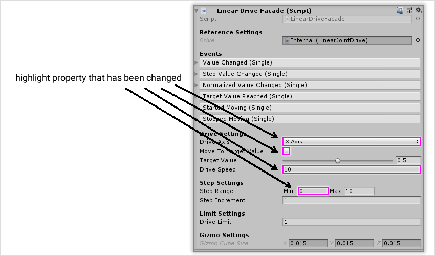
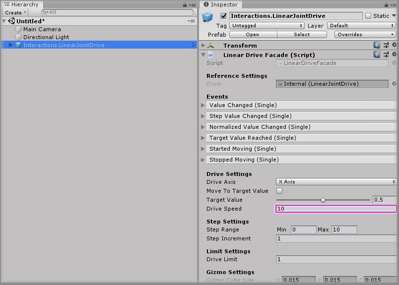

# Updating A Component Property Value

## Text Example

```
Select the `<GameObject>` GameObject from the Unity Hierarchy window and on the `<Component>` component change the `Property` property value to `<new value>`.
```

---

> Markdown output example

Select the `<GameObject>` GameObject from the Unity Hierarchy window and on the `<Component>` component change the `Property` property value to `<new value>`.

## Image Example

```

```


## Final Output

```
### Step X

Select the `Interactions.LinearJointDrive` GameObject from the Unity Hierarchy window and on the `Linear Drive Facade` component change the `Drive Speed` property value to `10`.


```

---

> Markdown output

### Step X

Select the `Interactions.LinearJointDrive` GameObject from the Unity Hierarchy window and on the `Linear Drive Facade` component change the `Drive Speed` property value to `10`.

