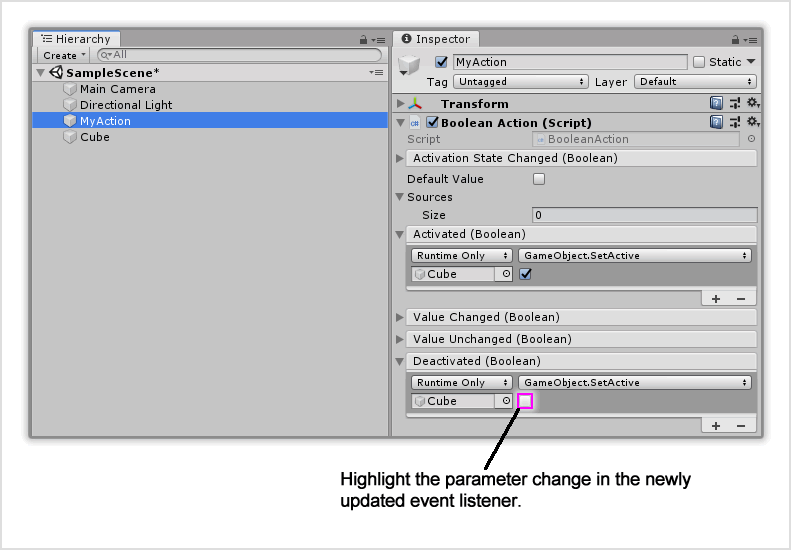
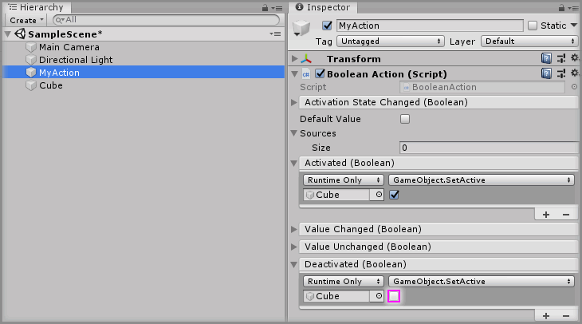

# Updating A Unity Event Listener

## Text Example

```
Do the same as [<Step X>] but for the `<Other Event Listener>` event parameter in the `<Component>` component, but _insert the different change_ under the `<Function>` function.

...
[<Step X>]: #<Step X>
```

---

> Markdown output example

Do the same as [Step X] but for the `<Other Event Listener>` event parameter in the `<Component>` component, but _insert the different change_ under the `<Function>` function.

[Step X]: #Step-X

## Image Example

```

```


## Final Output

```
### Step X

Do the same as [Step 5] but for the `Deactivated` event parameter in the `Boolean Action` component, but untick the checkbox under the `GameObject.SetActive` function.



[Step 5]: #Step-5
```

---

> Markdown output

### Step X

Do the same as [Step 5] but for the `Deactivated` event parameter in the `Boolean Action` component, but untick the checkbox under the `GameObject.SetActive` function.


[Step 5]: #Step-5

## Resources

* Example Graphic
  * [Fireworks PNG](assets/resource/FireworksPNG.fw.png)
  * [Photoshop PSD](assets/resource/PhotoshopPSD.psd)